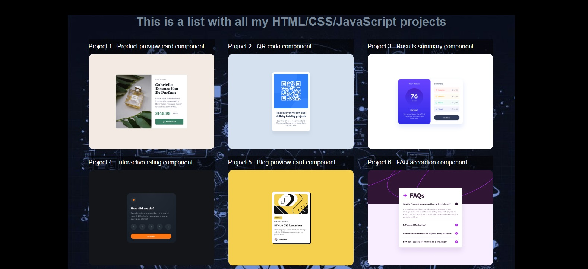

# Frontend Mentor - HTML/CSS/JS problems solved

### This is a list with all solutions of Frontend Mentor challenges to help me improve my coding skills by building realistic projects:
# <a href="https://xaoccc.github.io/">xaoccc.github.io</a>  

### Sample Screenshot of my first project:



Here is a screenshot of my first solution. As you can see, I used the online compiler of programiz.com. 

### Built with 

- HTML5 
- CSS3

### What I learned

```css
#content-box {
  	margin: 15% 33% 0% 33%;
  	overflow: hidden;
}
#item-description {
	display: table-row;
  }
h4{
  	letter-spacing: 2px;
}
```

And much more CSS features  
### Useful resources

- [Programiz](https://www.programiz.com/html/online-compiler/) - This site gave me the work environment.
- [CDN Fonts](https://www.cdnfonts.com/) - They gave me free font.
- [StackOverflow](https://stackoverflow.com/) - Here i got some answers about positioning of elements in the web page, especially display: table-row.
- [W3Schools](https://www.w3schools.com/) - There is no project without looking for info in this big old helpful library.

## Author

- Frontend Mentor - [@xaoccc](https://www.frontendmentor.io/profile/xaoccc)
- Facebook - [@georgi.tashev](https://www.facebook.com/georgi.tashev)

